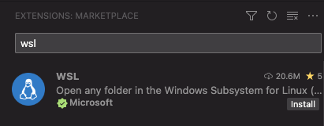

# Installation d’une machine de dev Windows (avec WSL)

## Ce qui sera installé

- WSL
- Visual Studio Code (fortement recommandé)
- Git
- zsh
- oh-my-zsh
- Volta et node
- GitHub CLI
- pnpm
- docker

## [WSL](https://learn.microsoft.com/fr-fr/windows/wsl/install)

Lancer un powershell en tant qu’administrateur, puis lancer les commandes suivantes :

```shell
wsl --install Ubuntu-22.04

wsl --set-default Ubuntu-22.04

wsl --set-version Ubuntu-22.04 2

wsl --set-default-version 2
```

Plus d’info :

- <https://learn.microsoft.com/fr-fr/windows/wsl/install>
- <https://learn.microsoft.com/fr-fr/windows/wsl/tutorials/wsl-containers>

## Visual Studio Code et les extensions recommandées

<!--@include: ./parts/vscode.md-->

Ajouter l’extension wsl :



## [Git](https://git-scm.com/)

Dans un terminal WSL :

```shell
sudo apt update
sudo apt install git
```

<!--@include: ./parts/git-config.md -->

## ZSH

<!--@include: ./parts/zsh-oh-my-zsh.md-->

## Polices d’écriture

<!--@include: ./parts/fonts.md-->

## Volta

Les commandes suivantes doivent être exécutées dans WSL.

<!--@include: ./parts/volta.md-->

## GitHub CLI

<!--@include: ./parts/github-cli-posix.md-->

## pnpm

[`pnpm`](https://pnpm.io/) est le gestionnaire de paquets du registre npm qu’il est recommandé d’utiliser.

Ouvrir un powershell et lancer la commande suivante :

<!--@include: ./parts/pnpm-win.md-->

Plus d’informations : <https://pnpm.io/installation>

## Docker desktop

### Installer docker dans WSL

Les commandes suivantes doivent être exécutées dans WSL.

<!--@include: ./parts/docker-posix.md-->
