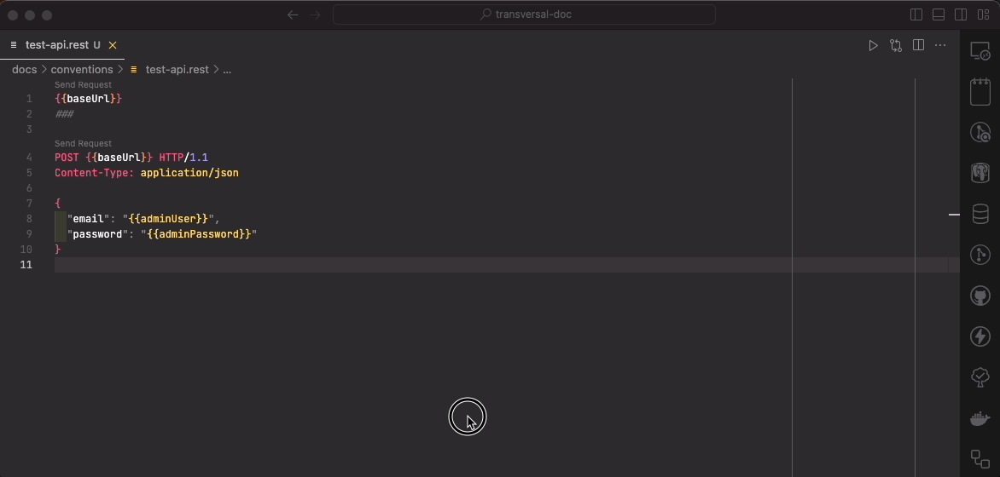

# REST Client

## Installation

Installer l'extension [REST Client](https://marketplace.visualstudio.com/items?itemName=humao.rest-client) dans VS Code.

## Utilisation basique

Cette ligne suffit à faire une requête `GET` depuis VSCode :

```
http://localhost:8080
```

Voici comment faire une requête `POST` :

```txt
POST http://localhost:8080/api/auth/token HTTP/1.1
Content-Type: application/json

{
  "email": "admin@example.com",
  "password": ""53CR37P455!"
}
```

Pour les requêtes `PUT` `PATCH` et `DELETE`, il suffit de remplacer le mot `POST` de la requête précédent par le verbe adéquate.

Voici le rendu dans VSCode :


## Utilisation des variables

### Créer des variables locales

Des variables locales au fichier `.rest` peuvent être ajoutées :

```txt
@baseUrl = http://localhost:3000/api
```

###  Utiliser des variables locales

Les variables définies peuvent s’utiliser entre `{{}}` :

```txt
###
{{baseUrl}}

###
{{baseUrl}}/healthcheck
```

Et il est possible d’utiliser les variables pour créer d’autres variables :

```txt
@protocol = http://
@host = localhost
@port = 3000
@apiPrefix = /api
@baseUrl = {{protocol}}{{host}}:{{port}}{{apiPrefix}}

###
{{baseUrl}}/healthcheck
```

### Récupérer des données d’une requête et les utiliser dans une autre

On peut aussi stocker dans une variable le résultat d’une requête :

Noter ici le `@name login` :

```txt
###
# @name login
POST {{base}}/auth/token HTTP/1.1
Content-Type: application/json

{
  "pseudo": "stormier",
  "password": "S0qFkl8*J5DL"
}
```

Et l’utiliser plus tard dans une autre requête :

Noter ici l’utilisation de `login` qui correspond au nom donné plus haut, qui sera désormais un objet qui va contenir la réponse dans sa propriété `response`, qui elle-même contiendra le corps de la réponse dans la propriété `body`. Ici, le corps de la réponse aura été un objet avec une propriété `token` qui contiendra le jeton d’accès (access token) au format JWT.

```txt
###
GET {{base}}/lessons HTTP/1.1
Authorization: Bearer {{login.response.body.token}}
```

## Utilisation avancée

Il est possible de paramétrer plusieurs environments dans les paramètres vscode du projet (`.vscode/settings.json`) ou dans vos paramètres :

```json
  "rest-client.environmentVariables": {
    "local": {
      "baseUrl": "http://localhost:3000",
      "adminUser": "admin@example.com",
      "adminPassword": "password"
    },
    "dev": {
      "baseUrl": "https://dev.example.interieur.gouv.fr",
      "adminUser": "obi-wan.kenobi@interieur.gouv.fr",
      "adminPassword": "1_H4V3_4_84D_F33L1N9_480U7_7H15"
    },
    "prod": {
      "baseUrl": "https://prod.example.interieur.gouv.fr",
      "adminUser": "qui-gon.jin@interieur.gouv.fr",
      "adminPassword": "1_53N5_900D_1N_H1M"
    }
  },
```

Que l’on peut utiliser ensuite en tant que variables comme précédemment :

```txt
POST {{baseUrl}} HTTP/1.1
Content-Type: application/json

{
  "email": "{{adminUser}}",
  "password": "{{adminPassword}}"
}
```

Changer l’environnement dans VSCode se fait avec la commande `switch environment` de l’extension Rest Client :


